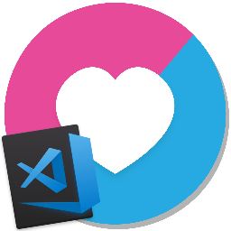

# Your new game project #

This is your VSCode template for building your LÖVE game. It's tested on Windows and Mac, should work on Linux, too.

Start by forking or cloning this repo and open it with Visual Studio Code.

## Preparing your build ##

- Download and install [NodeJS (incl. npm)](https://nodejs.org) or use your package manager of your choice (like apt-get, brew, etc.) to get it.

- Enter your terminal (View > Integrated Terminal) and prepare:

```bash
npm install -g gulp
npm install
```

- Go to Code/File > Preferences > Keyboard Shortcuts > Modify keybindings.json and paste this in the right window:

```json
{ "key": "ctrl+l", "command": "workbench.action.tasks.runTask", "args": "launch" },
{ "key": "cmd+l", "command": "workbench.action.tasks.runTask", "args": "launch" },
```
(using a LÖVE launcher extension won't work, since it will expect the main.lua in the root directory)

- Install [Love2d Snippets](https://marketplace.visualstudio.com/items?itemName=pixelwar.love2dsnippets), which makes your life easier.

- Configure your `.vscode/tasks.json` (launcher configuration) and `gulfconf.js` (build configuration) to point to the right directories. Toggle make-variables in your gulpconf for your target platforms. (Mac not supported yet, iOS will only copy files, not build) 

## Tasks ##

Except for the keyboard shortcuts, all tasks are triggered by typing those in the Terminal.

### CTRL+L / CMD+L (Launch) ###

Starts the game at the src directory. If it does not, please check the tasks.json. On Windows, you have to use the Command Promt (instead of PowerShell) as default terminal. 

### gulp dist ###

Copies all source files to the `dist` folder. Specify extensions in the `gulpconf.js`. Will clean the `dist` folder beforehand.

### gulp minify-lua ###

Uses [luamin](https://github.com/mathiasbynens/luamin) to compress your lua files, that are located in the _dist_ folder.

### gulp merge-animations ###

Will combine `*.ani.png` files in the `src` and `dist/src` folder into `*.a.png` files. Each file will be a row in the output file. Files will be grouped by the part before the first underscore \_ of the source filename.

Example: `sample_move0.ani.png`, `sample_move1.ani.png`, `sample_move2.ani.png`, `sample_move3.ani.png` will be combined to `sample.a.png`.

### gulp make-love ###

Builds a `.love` file from the `dist/src` directory and stores it in `dist`.

### gulp make-win ###

Combines the `.love` file with `love.exe` to the folder `dist/win` and copies `.dll` dependencies to that folder, too.

### gulp make-android ###

Copies the `.love` file and all files at `inject/android` to the Android port and runs `gradlew build` in that folder. 

### gulp make-mac ###

This feature is not supported. You are free to implement it and add a pull request. 

### gulp make-ios ###

Copies the `.love` file and all files at `inject/ios` to the iOS port. You have to compile it yourself, afterwards. 

### gulp / gulp build ###

Does all tasks above, except for the launch task. `make-*` task will only execute if they are enabled in the `gulpconf.js`

## Questions? ##

Visit the [Forum Thread](https://love2d.org/forums/viewtopic.php?p=218846#p218827)